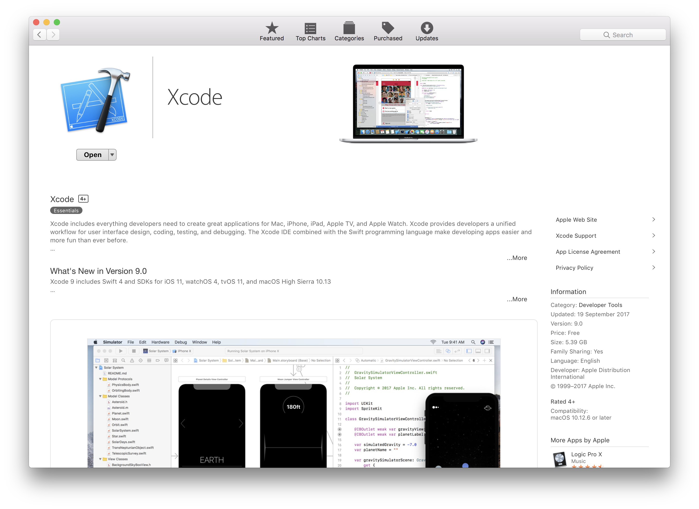

# Installing Jekyll

In order to install Jekyll on your Mac you need to install a couple of things first.  One is Homebrew, Ruby and then Jekyll.  

If this sounds like Spanish don't worry its not.  

---

#### 1. Download Xcode from App Store 

Go to the App Store and download Xcode and Install.  

---

#### 2. Install Additional Components

It may ask you to install additional components. Install these also.  Once this has been installed. Close Xcode. 

---

#### 3. Open Terminal.  Terminal What? Go to Applications > Utilities > Terminal.  

Its a black icon like this.  

When you open terminal it looks this this. TOTALLY MATRIX MAN.

---
 
#### 4. Installing homebrew: Use this command in terminal

`(/usr/bin/ruby -e "$(curl -fsSL https://raw.githubusercontent.com/Homebrew/install/master/install)")`

Some crazy Matrix type stuff should begin to happen.  Don't worry this is completely normal.  You might need to hit enter to continue or input your password.

---

#### 5. Install ruby: Use this command in terminal

`brew install ruby`

---

#### 6. Install Jekyll: Use this command in terminal

`sudo gem install jekyll bundler`

---

#### 7. Installation Complete 

Hooray! Installation should be finished.  To check you can run the command

`jekyll-v`

This will show which version of Jekyll you are running. Should be Jekyll 3.5.2

